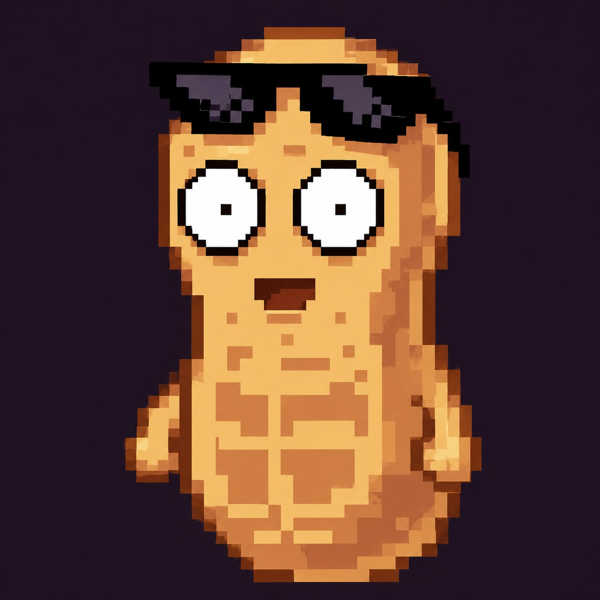
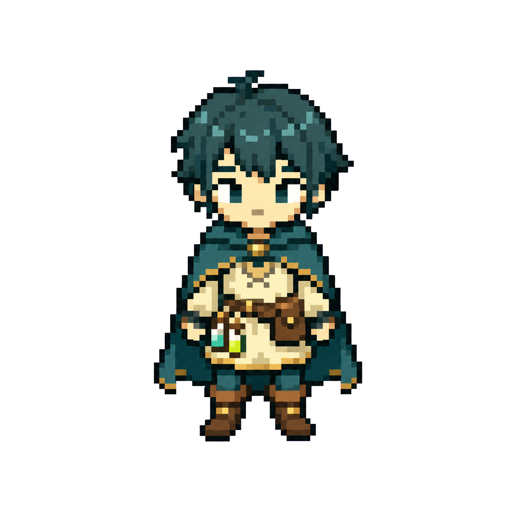
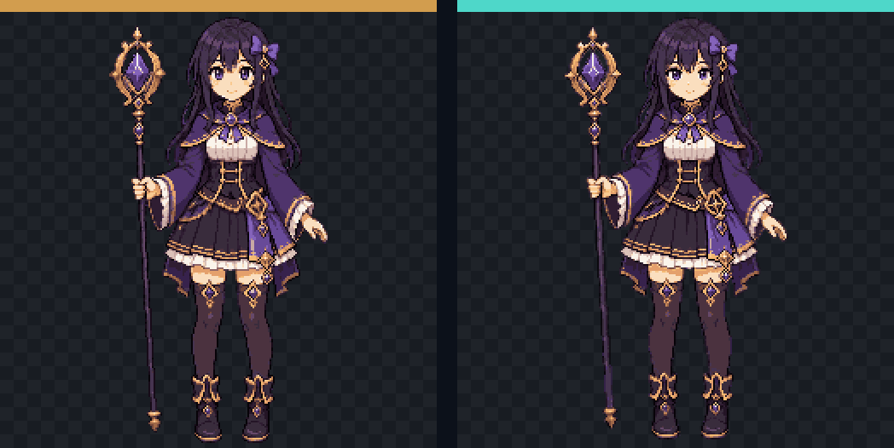

<div align="center">
  

  <h1>Pixelate</h1>

  <p><strong>A local-first pixel image and sprite animation workbench.</strong></p>
  <p>Turn externally generated images and videos into clean, consistent, game-ready pixel assets—directly in your browser.</p>

  <p>
    <a href="https://pixelate.nickpeanut.com"></a>
    <a href="https://github.com/nickpeanutai/pixelate/stargazers"></a>
    <a href="LICENSE"></a>
  </p>

  <p>
    <a href="https://pixelate.nickpeanut.com">Open the app</a>
    ·
    <a href="#quick-start">Run locally</a>
    ·
    <a href="docs/pixel-processing.md">Pixel pipeline</a>
    ·
    <a href="docs/architecture.md">Architecture</a>
  </p>
</div>

---

## From generated media to production-ready pixels

Pixelate fills the gap between image or video generation and a usable game asset. Build a controlled prompt, generate media with the tool of your choice, then import the untouched result for deterministic processing, frame selection, preview, and export.

No model API, provider account, or server-side media pipeline is required. Source files and project data stay on your device.

## The problem: pixel-styled is not pixel-accurate

State-of-the-art generators such as GPT Image 2, Nano Banana 2, Imagen 2, and similar models can create convincing *pixel-art-looking* images, but they are general-purpose image models—not deterministic sprite renderers. A prompt can describe the right style and dimensions while the returned raster still violates the structural constraints a game asset needs.

For example, a request for a **256 × 256 pixel-art sprite** can arrive as a **1254 × 1254 image** containing an enlarged, irregular pseudo-pixel lattice. In the example below, the apparent grid is roughly **318 × 308** with low confidence—not the requested 256 × 256 native grid.

| Requested | A generator may return | A production asset needs |
| --- | --- | --- |
| Exact 256 × 256 pixel art | A larger raster that only *looks* like 256 × 256 pixel art | Exactly 256 × 256 intentional output cells |
| Uniform square pixels | Uneven cell widths, inconsistent spacing, or a warped lattice | One stable, aligned grid across the sprite |
| One flat color per pixel | Multiple slightly different colors inside a single apparent pixel | Internally consistent cells and a controlled palette |
| Crisp hard edges | Antialiasing, blur, halos, and partial-coverage edge pixels | Deliberate silhouettes and preserved one-pixel details |
| Transparent or exact chroma background | Near-magenta/green backgrounds, residue, holes, or insufficient margins | Clean alpha with predictable edge treatment |
| Consistent animation frames | Frame-to-frame shifts in scale, position, grid phase, and color | One crop, lattice, scale, and palette for the sequence |

Simple resizing does not solve these problems. It can preserve the false lattice, miss thin features, flatten outlines, and amplify noisy colors. Pixelate instead detects the apparent grid, validates it, aligns one rigid lattice, samples edges deliberately, removes controlled chroma backgrounds, and quantizes the result into a stable palette.

> [!NOTE]
> Pixelate corrects raster structure; it does not redraw the subject. Semantic generation mistakes—incorrect anatomy, missing props, malformed objects, or the wrong pose—must be corrected in the source generator before import.

| | |
| --- | --- |
| **Local-first by design** | Media processing happens in the browser. Project metadata uses IndexedDB, while source media uses OPFS when available. |
| **Pixel-grid recovery** | FFT-based grid detection with a Sobel-gradient fallback recovers the underlying pixel lattice from enlarged or softened source art. |
| **Controlled transparency** | Validate and remove solid magenta or green backgrounds with edge-aware chroma matting, despill, and focused diagnostics. |
| **Stable animation output** | Extract selected video frames, lock one grid across the sequence, and apply a shared palette to reduce spatial jitter and color flicker. |
| **Deterministic color** | Alpha- and contrast-weighted palette construction preserves outlines, highlights, and small details without inventing new content. |
| **Game-ready export** | Download processed images and animation sprite sheets with predictable source-based filenames and frame dimensions. |

## Workflow

1. **Build a prompt** — choose an image or animation template and describe the subject in Chinese or English.
2. **Generate externally** — copy the completed prompt into the image or video tool you already use.
3. **Import the source** — bring the untouched image or video into Pixelate; uploads are not sent to a remote service.
4. **Refine the asset** — remove a controlled chroma background, recover the pixel grid, choose output size and palette, or select exact video frames.
5. **Export for your game** — download a processed PNG or an animation sprite sheet.

## Pixel-processing pipeline

Pixelate uses a non-neural, browser-local pipeline designed to preserve deliberate pixel structure:

```text
Source media
    ↓
Chroma validation and removal
    ↓
FFT grid proposal → PerfectPixel validation → Sobel fallback
    ↓
Rigid lattice alignment and edge-aware downscaling
    ↓
Perceptual palette generation and quantization
    ↓
PNG or sprite-sheet export
```

The repository keeps visual regression fixtures for reviewing algorithm changes. The example begins with a magenta-keyed source image and compares a naïve nearest-neighbor pixelation baseline with Pixelate's optimized result. Both use the same transparent content crop, 256 × 256 canvas, and exact 24-color palette, isolating the spatial image-quality difference.

<div align="center">
  <p><strong>Example source</strong></p>
  
  <p><strong>256 × 256 output comparison</strong></p>
  <p>Naïve baseline (amber) · Pixelate (teal)</p>
  
</div>

Read the full rationale and reproduction steps in [Pixel-art processing pipeline](docs/pixel-processing.md).

## Animation workspace

The animation workflow is built around deliberate source-frame selection:

- Set a persisted start and end range directly on the video timeline.
- Auto-select evenly spaced frames with an independent extraction FPS.
- Add, move, preview, or remove individual source markers.
- Inspect untouched extracted frames before applying any processing.
- Keep original frames or process them through the shared pixel-art pipeline.
- Reopen the extracted-frame drawer to reprocess the original batch at any time.

## Quick start

### Prerequisites

- [Node.js](https://nodejs.org/)
- [pnpm](https://pnpm.io/)

### Local development

```bash
git clone https://github.com/nickpeanutai/pixelate.git
cd pixelate
pnpm install
pnpm dev
```

Vite will print the local development URL in your terminal.

### Verification

```bash
pnpm check
```

The verification suite runs TypeScript checks, unit tests, and a production build.

## Commands

| Command | Purpose |
| --- | --- |
| `pnpm dev` | Start the Vite development server. |
| `pnpm build` | Create the production client build in `dist/client`. |
| `pnpm preview` | Preview the production build locally. |
| `pnpm test` | Run the Vitest test suite. |
| `pnpm check` | Run type checking, tests, and the production build. |
| `pnpm compare:pixels` | Regenerate the naïve-baseline-versus-Pixelate comparison fixtures. |
| `pnpm deploy:cloudflare:dry-run` | Validate the Cloudflare Worker bundle without deploying. |
| `pnpm deploy:cloudflare` | Build and deploy with Wrangler. |

## Architecture

Pixelate is a pnpm workspace with small, focused modules:

| Module | Responsibility |
| --- | --- |
| `src/` | React application, image workflow, animation workspace, canvas, and frame-selection UI. |
| `packages/pixel-core` | Chroma processing, grid detection, downscaling, palette generation, and frame processing. |
| `packages/project-schema` | Project migrations, IndexedDB metadata, and OPFS source-media persistence. |
| `packages/editor-core` | Non-destructive frame history with undo and redo. |
| `packages/export-core` | PNG composition, sprite sheets, manifests, bundles, GIF, and APNG encoders. |
| `worker/` | Cloudflare Worker routing, HTTPS redirects, static assets, and SPA fallback behavior. |

For implementation details, see [Architecture](docs/architecture.md).

## Privacy model

> Pixelate does not upload imported media or connect to image and video generation services. Processing runs locally, and persistent project data remains in browser-managed storage.

Network access is limited to ordinary application delivery and the optional GitHub star-count request shown in the header.

## Contributing

Issues and pull requests are welcome. Before submitting a change:

```bash
pnpm check
pnpm deploy:cloudflare:dry-run
```

Changes to the pixel-processing algorithm should also regenerate and review the comparison fixtures:

```bash
pnpm compare:pixels
```

## License

Pixelate is available under the [MIT License](LICENSE). Third-party licenses, research references, and attribution details are documented in [THIRD_PARTY_NOTICES.md](THIRD_PARTY_NOTICES.md).
